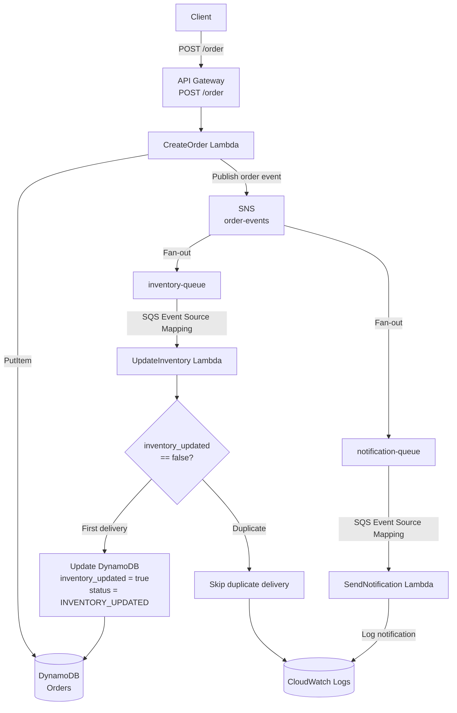

# Event-Driven Order Processing Pipeline

A serverless, event-driven order processing pipeline built with **AWS API Gateway, Lambda, DynamoDB, SNS, SQS, IAM, and CloudWatch**.

The project demonstrates **SNS fan-out, asynchronous processing, SQS at-least-once delivery, idempotent consumers, and least-privilege IAM**.

## Architecture



## Workflow

1. The client sends `POST /order` to API Gateway.
2. `CreateOrder` stores the order in DynamoDB with `status = PENDING`.
3. `CreateOrder` publishes an order event to SNS.
4. SNS fans the event out to `inventory-queue` and `notification-queue`.
5. SQS event source mappings invoke the corresponding Lambda consumers.
6. `UpdateInventory` conditionally updates the order to `INVENTORY_UPDATED`.
7. `SendNotification` logs a simulated notification to CloudWatch.
8. Duplicate inventory messages are ignored through the DynamoDB conditional update.

## Tech Stack

- **Python 3.12**
- **AWS API Gateway**
- **AWS Lambda**
- **Amazon DynamoDB**
- **Amazon SNS**
- **Amazon SQS**
- **AWS IAM**
- **Amazon CloudWatch**
- **AWS CLI**

## Project Structure

```text
order-pipeline/
├── aws/
├── iam/
├── lambdas/
│   ├── create_order/
│   │   └── create_order.py
│   ├── update_inventory/
│   │   └── update_inventory.py
│   └── send_notification/
│       └── send_notification.py
├── tests/
│   └── load_test.py
├── docs/
├── requirements.txt
├── README.md
└── .gitignore
```

## Setup & Run

The AWS infrastructure is assumed to already be deployed. The project uses **`ap-south-1`** in the examples below.

### 1. Configure AWS CLI

```bash
aws configure
```

Set the default region to:

```text
ap-south-1
```

Verify:

```bash
aws sts get-caller-identity
```

### 2. Configure the API URL

Update `tests/load_test.py`:

```python
URL = "https://YOUR_API_ID.execute-api.ap-south-1.amazonaws.com/dev/order"
```

### 3. Install dependencies

```bash
source venv/bin/activate
pip install -r requirements.txt
```

### 4. Run the pipeline

```bash
curl -X POST https://YOUR_API_ID.execute-api.ap-south-1.amazonaws.com/dev/order \
  -H "Content-Type: application/json" \
  -d '{"item_name": "Mechanical Keyboard", "quantity": 1}'
```

Expected response:

```json
{
  "order_id": "some-uuid",
  "status": "PENDING"
}
```

The request is then processed asynchronously through SNS → SQS → Lambda.

### 5. Verify the result

Check DynamoDB:

```bash
aws dynamodb scan \
  --table-name Orders \
  --region ap-south-1
```

The processed order should eventually have:

```text
status = INVENTORY_UPDATED
inventory_updated = true
```

Check CloudWatch logs for `SendNotification` to verify the notification.

### 6. Run the load test

Set the API URL in `tests/load_test.py`, then:

```bash
python3 tests/load_test.py
```

The test sends 100 requests with a concurrency of 10 and reports success rate and latency statistics.

## Key Design Concepts

### SNS Fan-Out

A single order event is published once and delivered independently to both SQS queues:

```text
             ┌──> inventory-queue
SNS ─────────┤
             └──> notification-queue
```

This decouples inventory processing from notification processing.

### Idempotent Processing

SQS provides at-least-once delivery, so the same message can be delivered more than once.

`UpdateInventory` uses:

```python
ConditionExpression='inventory_updated = :false'
```

Only the first delivery can update the order. Duplicate deliveries are skipped.

### Eventual Consistency

The API returns after the order is created and the event is published. Inventory and notification processing happen asynchronously, so the order may initially be `PENDING` before becoming `INVENTORY_UPDATED`.

### Least-Privilege IAM

Each Lambda is given only the permissions required for its role:

- `CreateOrder` → DynamoDB `PutItem` + SNS `Publish`
- `UpdateInventory` → DynamoDB `UpdateItem` + SQS access
- `SendNotification` → SQS access
- All Lambdas → CloudWatch logging

## Load Testing

`tests/load_test.py` sends concurrent requests to the API and reports:

- Total requests
- Successful requests
- Failed requests
- P50 latency
- P99 latency
- Minimum latency
- Maximum latency

The load test measures the synchronous API path; downstream SQS/Lambda processing continues asynchronously.

## Cleanup

Delete the AWS resources when finished to avoid unnecessary charges:

- DynamoDB `Orders` table
- `inventory-queue`
- `notification-queue`
- SNS `order-events` topic
- `CreateOrder` Lambda
- `UpdateInventory` Lambda
- `SendNotification` Lambda
- API Gateway API
